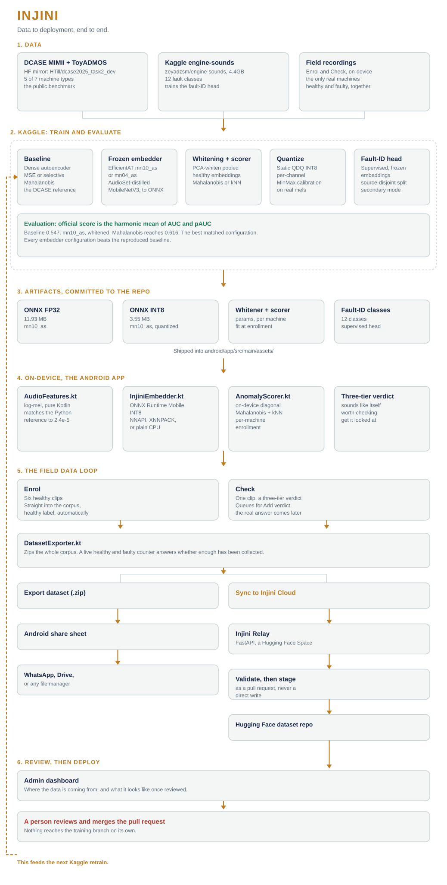

# Injini

[](https://github.com/rapha18th/injini/releases/latest/download/app-debug.apk)
[](https://github.com/rapha18th/injini/releases/latest)

Offline acoustic condition monitoring for engines and diesel generators. A phone listens to a machine the way a mechanic does. It learns the sound of that machine when it runs well, and flags the sound when something changes. No cloud connection required. No specialist hardware. No fault-labeled training data needed to get started.

The link above always points at the current release. Download it straight to a phone, allow installs from the browser or file manager when asked, and install. Debug-signed, no Play Store yet, this is a field-pilot build.

## The idea

Anomalous sound detection has a real 2026 state of the art, and it does not require a fault-labeled dataset for every machine it monitors. A model pretrained on general audio (AudioSet) already carries most of the structure needed to tell a healthy mechanical sound from a strange one. Freeze that model, embed a handful of healthy recordings from one specific machine, and measure how far a new recording sits from that small healthy cluster. The distance is the anomaly score.

Injini ships that recipe, compressed to run entirely on an Arm phone: a frozen AudioSet-distilled MobileNetV3 embedder (EfficientAT), quantised to INT8, scored against a per-machine healthy fingerprint with a whitened distance metric. The neural work is the embedding. The decision is a few lines of linear algebra on the CPU.

The deeper goal is to benchmark that baseline honestly in the field, not just in a lab. Every recording a phone takes gets an eventual real-world verdict, healthy confirmed or an actual fault, once someone has looked at the machine. Comparing the model's on-device guess against that verdict, at scale, across real machines in real conditions, does two things at once: it stress-tests today's baseline outside a curated benchmark, and it builds exactly the labeled dataset a better model would need next.

## Architecture

Data to deployment, end to end.



## The recipe

| Stage | What | Where |
|---|---|---|
| Features | 32 kHz, pre-emphasis, 128 Kaldi mel bands, EfficientAT's exact spec, pure NumPy | `src/features.py`, ported to `AudioFeatures.kt` |
| Embedder | Frozen EfficientAT `mn10_as` (960-d) or `mn04_as` (384-d), feature extractor only | `src/embedder.py` → ONNX |
| Quantise | Static QDQ INT8, per-channel, MinMax calibration on real mels | `export/quantize.py` |
| Score | Per-machine enrollment → Mahalanobis (full-cov in eval, diagonal + kNN on device) | `src/anomaly.py`, `AnomalyScorer.kt` |
| Fault ID | Optional supervised head on frozen embeddings, source-disjoint split | `src/faultid.py` |

## Why whitening matters

A raw, unwhitened distance in embedding space sits at baseline. The dimensions of a frozen embedding carry wildly different variance, and an ordinary distance metric lets the noisiest dimensions dominate the score regardless of what actually changed acoustically. Whitening the embedding space, scaling each dimension by its own variance under the healthy population, before measuring distance is what turns a frozen embedder into a working anomaly detector. This was verified with a direct ablation, not assumed.

## Evaluation

Every claim here is anchored to a published DCASE figure. Data comes from the public HuggingFace mirror `HTill/dcase2025_task2_dev` by default.

```bash
pip install -r requirements.txt

# EfficientAT code + weights
git clone https://github.com/fschmid56/EfficientAT.git vendor_efficientat
mkdir -p vendor_efficientat/resources
wget -P vendor_efficientat/resources \
  https://github.com/fschmid56/EfficientAT/releases/download/v0.0.1/mn10_as_mAP_471.pt \
  https://github.com/fschmid56/EfficientAT/releases/download/v0.0.1/mn04_as_mAP_432.pt
python src/features.py                       # cache the Kaldi mel matrix

# baseline, reference ceiling, then the phone pipeline: all default to the HF mirror
python src/baseline_ae.py  --epochs 100
python src/eval_dcase.py   --backend passt --scorer knn
python src/embedder.py     --name mn10_as --out models/injini_mn10_as_fp32.onnx
python src/eval_dcase.py   --backend onnx:models/injini_mn10_as_fp32.onnx --scorer knn
python export/quantize.py  --fp32 models/injini_mn10_as_fp32.onnx --calib-dir data/calib --n-calib 256
python src/eval_dcase.py   --backend onnx:models/injini_mn10_as_int8.onnx --scorer knn
```

`notebooks/injini_train.ipynb` runs the whole sequence on Kaggle and is fully self-contained: no private dataset, nothing to clone beyond the public EfficientAT repository. `notebooks/injini_faultid_only.ipynb` reruns just the supervised head.

### Results (Kaggle, CPU, five DCASE machine types)

| System | Official score | Mean AUC |
|---|---|---|
| DCASE autoencoder baseline, reproduced | 0.547 | 0.560 |
| PaSST transformer, whitened, kNN | 0.596 | 0.637 |
| **mn10_as, whitened, Mahalanobis (best)** | **0.616** | **0.661** |
| mn10_as, whitened, kNN | 0.613 | 0.655 |
| mn10_as, whitened, kNN, INT8 | 0.599 | 0.640 |
| mn04_as, whitened, kNN | 0.593 | 0.630 |
| mn04_as, whitened, kNN, INT8 | 0.602 | 0.644 |

Every embedder configuration beats the reproduced baseline. `mn10_as` with kNN edges past the PaSST transformer reference under the same scorer, 0.613 against 0.596. PaSST ran capped to CPU and to the same five machine types, so this comparison is directional rather than a definitive verdict on either architecture, but it is fair and matched.

Supervised fault-ID head (secondary mode): **0.362 macro F1** across 12 classes, source-disjoint split, mn10_as embeddings. A clean, randomly split dataset can reach a ceiling near 98 to 99%. A source-disjoint split of a messy, mixed-provenance public corpus earns a lower number honestly, and that honesty is the point of reporting it.

### On-device

| Measurement | INT8 | FP32 |
|---|---|---|
| Steady-state embed | 44.1 ms | 87.5 ms |
| Load time | 241.7 ms | 87.1 ms |
| Executed per node | CPUExecutionProvider: all 3670 nodes | same |

Measured on a mid-range Android phone. Process memory sits at 178.2 MB PSS, thermal status LIGHT.

| Embedder | Params (extractor) | ONNX FP32 | ONNX INT8 |
|---|---|---|---|
| `mn10_as` | 2.97 M | 11.93 MB | 3.55 MB |
| `mn04_as` | 0.52 M | 2.14 MB | 0.93 MB |

## Android: turning deployment into a dataset

Every machine gets its own fingerprint. **Enrol** records six healthy ten-second clips and builds that fingerprint; every one of those clips also joins the training corpus under the healthy label, since a clip recorded during enrolment is healthy by definition. **Check** records one clip, returns an instant three-tier read against the fingerprint, and queues that same clip for a real answer. The model's guess is not the label. The label comes later, from **Add verdict**, once someone has actually looked at the machine: healthy confirmed, or the real fault.

That verdict closes the loop. Every Check gets compared automatically against its eventual outcome, so the app carries a running field benchmark of its own model, not just a growing pile of recordings. A verdict that contradicts a healthy fingerprint flags that machine for re-enrollment, since the fingerprint itself may have been built on a bad sample. The whole recording corpus, including the still-pending queue, can be exported as a zip at any point, or synced to a shared store for retraining. See `hf_space/` for the sync backend.

Build from source:

```bash
cp models/injini_mn10_as_int8.onnx models/injini_mn10_as_fp32.onnx android/app/src/main/assets/
cd android && ./gradlew assembleDebug
adb install -r app/build/outputs/apk/debug/app-debug.apk
```

Feature parity between the Kotlin and Python feature pipelines:

```bash
cd android && ./gradlew testDebugUnitTest --tests "com.injini.app.AudioFeaturesParityTest"
```

## Limitations

- The public HuggingFace mirror used for evaluation holds 5 of the 7 official DCASE 2025 machine types. ToyCar and ToyTrain are missing. Every result here covers bearing, fan, gearbox, slider, and valve.
- The fault-ID head's 0.362 macro F1 reflects a source-disjoint split of a messy, mixed-provenance public corpus, not a ceiling on the method itself.
- On-device calibration with only six enrollment clips across a 960-dimensional embedding is a real, unresolved gap. A near-zero-variance dimension in that small a sample can dominate the whitened distance, and the DCASE evaluation's full-covariance estimate, run on hundreds of clips, does not validate this diagonal, six-clip approximation. A shrinkage estimator (Ledoit-Wolf) over the enrollment covariance is the direct fix, and is the next thing this recipe needs.

## Licences

Code is MIT. EfficientAT weights are MIT (fschmid56/EfficientAT). The DCASE 2025 dev set is CC BY-NC-SA 4.0 and is not redistributed here. Kaggle `zeyadzsm/engine-sounds` declares Apache-2.0. `malakragaie/car-diagnostics-dataset` has no stated licence and is used for local evaluation only.
